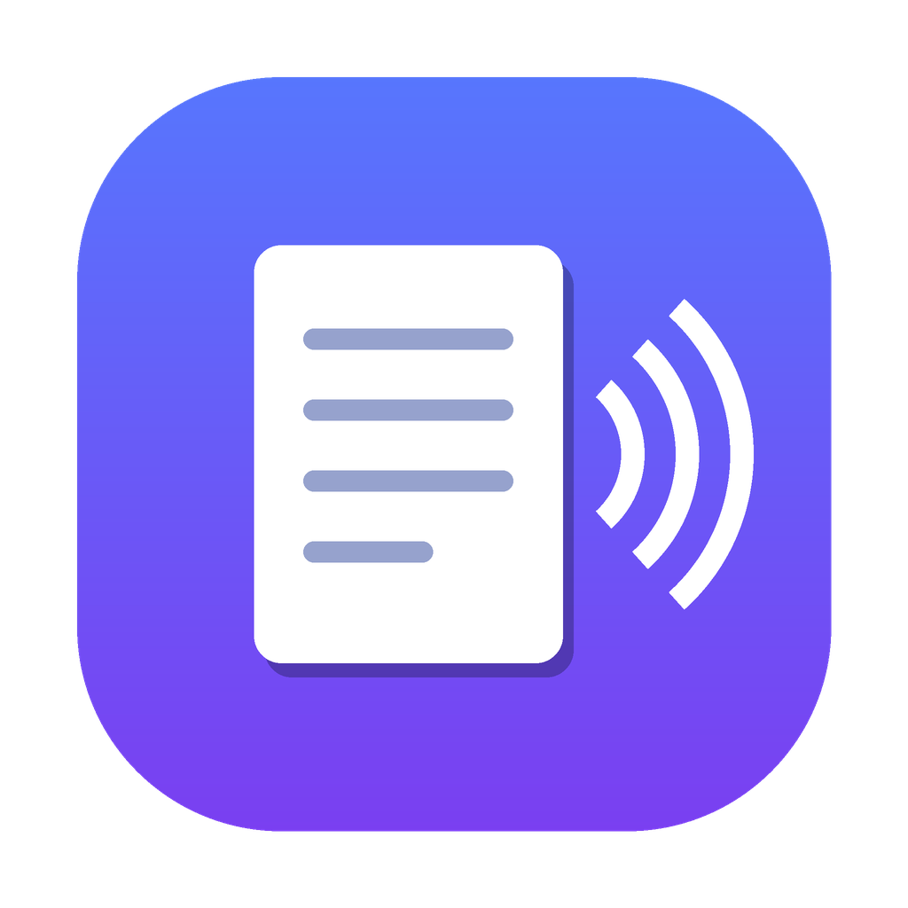

# Read Aloud

<p align="center"></p>

A native macOS app that reads web articles aloud in a natural voice — paste a
URL, it extracts the clean article text and reads it with **Kokoro**, an
open-source neural text-to-speech model that runs **locally, free, and offline**.

Also exports articles to **MP3** so you can listen on your iPhone.

## Features

- Paste an article URL → clean text extraction (Mozilla Readability.js)
- Natural local TTS via Kokoro (default voice: **Lewis**, British male; 8 voices)
- Play / pause / skip-by-sentence, speed control, click-to-jump highlighting
- **Export MP3** (in-app button or batch CLI) → saved to iCloud Drive, syncs to
  the iPhone Files app
- No API keys, no internet (after model download), no usage limits

## Requirements

- macOS 14+ on Apple Silicon
- Swift toolchain (Xcode Command Line Tools — full Xcode not required)
- Homebrew packages: `espeak-ng` (Kokoro phonemes), `ffmpeg` (MP3 encoding)
- Python 3.12

## Setup

```bash
brew install espeak-ng ffmpeg
python3 -m venv .venv
.venv/bin/pip install -r requirements.txt
```

## Build & run the app

```bash
./build.sh run          # compiles ReadAloud.app and launches it
```

The app auto-starts the local voice server (`tts_server.py`) on launch.
`./stop-engine.sh` stops it (it holds ~1–2 GB RAM while running).

## Export articles to MP3

```bash
./export https://example.com/article          # single
./export url1 url2 url3                         # several
./export --file urls.txt                        # a list (one URL per line)
./export https://… --voice bm_george           # pick a voice
```

MP3s land in `~/Library/Mobile Documents/com~apple~CloudDocs/ReadAloud`
(iCloud Drive) and appear in the **Files** app on your iPhone.

## Private podcast feed

Exports can also appear as episodes of a private podcast in Apple Podcasts
(playback position, speed, Watch/CarPlay). One-time setup: see
`SETUP_PODCAST.md` (free Cloudflare R2 bucket + "Follow a Show by URL").

- `./export <url>` registers the episode and republishes the feed automatically
- `./podcast-sync` sweeps up in-app exports, rebuilds `feed.xml`, uploads
- `podcast.py` holds the feed/upload logic; `podcast_config.json` (gitignored)
  holds the R2 credentials and secret feed token
- The feed sets `itunes:block` and lives behind an unguessable URL - it is a
  personal, private feed, not for distribution

## Architecture

| Piece | What it does |
|---|---|
| `ReadAloud/Sources/*.swift` | SwiftUI app: UI, WKWebView+Readability extraction, AVAudioPlayer playback |
| `tts_server.py` | Local HTTP server; loads Kokoro once, serves `/speak` (sentence) + `/export` (article MP3) |
| `tts_core.py` | Shared Kokoro synthesis + MP3 encoding |
| `readaloud-export.py` | Batch URL → MP3 CLI (uses trafilatura for extraction) |
| `build.sh` | Compiles the app bundle with `swiftc` |

## Notes

The Kokoro engine is Python, so it doesn't run on iOS. The MP3 export is the
bridge to iPhone. A future native iOS app would reuse the WKWebView extraction
and AVAudioPlayer playback, with an on-device or cloud voice.
